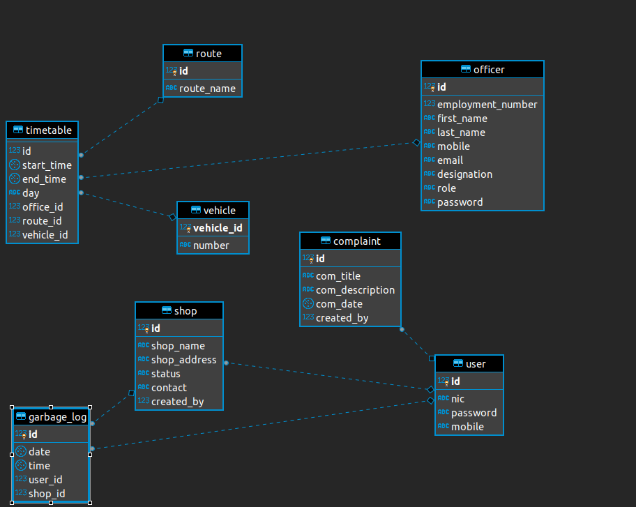

## Eco Waste Management System

Welcome to the Garbage Management System designed by SOCSSabaragamuwa. We are delighted to accompany you throughout this journey to go green.

The communication culture, communication channels and the contributing policies as well as the documentation best practices are given below.

Getting Started One of the stages in waste management is waste collection, and as global waste generation continue to increase year after year, the need for better and more efficient waste disposal, collection and management methods become more evident and urgent. Automated forms of waste collection are very expensive and far from being affordable in many low income communities, especially in the so called developing countries. To solve this dilemma, mobile technologies are considered for use in waste collection as a prospective means of improving waste management. This application is an attempt to proffer a generic but yet concrete and efficient solution to theproblems associated with waste collection via the application of mobile technologies

## Workflow


## Coding Best Practises that were followed.
- Used `Promises`
- Used `ES-6`
- Centralized error handling
- Logging with `Winston`
- PostgreSQL with connection pooling.
- Password Hashing using `bcrypt`
- CI with heroku
- Dockerized
- API documentation with swagger(OpenAPI 2.0)
- Isolated configuration files from the code

## DevOps Stages
•	Version Control- Source code management is done with git and who does the change is also recorded with git. With proper documentation policies and pull request templates the version control is addressed in our project.
•	Continuous integration -Travis 
•	Continuous delivery -Travis
•	Continuous deployment -not done in our project as we will validate every pull request

## Communication Channels
- Slack channel: 
letmehackbrogrammers.slack.com
- Google mailing list:
join the mailing list through google groups "let me hack brogrammers"

## Communication culture

Please treat each other, as well as the public, in an excellent way. What it means to “be excellent” is the following:

-Be radically inclusive to existing members and newcomers looking to learn or participate
-Be totally respectful of each others abilities, interests, and personal differences
-Be exceedingly kind even in moments of disagreement while working towards consensus
-Educate and illuminate others with something you know more about
-Be open to feedback from others in the community, be it technical skill or interpersonally
-These traits exemplify the type of community we strive for with Open Source Design. We want a diverse community where members treat each other excellently, at all times.

We want Open Source Design to be diverse because we A) believe in equality and B) know that diversity leads to healthier culture, which outputs better creativity.


## Contributing guidelines
Pull requests are welcome. For major changes, please open an issue first to discuss what you would like to change.

Please make sure to update tests as appropriate.

When making a pull request fill the pull request template generated, in clear and simple terminologies highlighting what was changed.

If you need help, you can ask questions on our mailing list and the slack channel.


## Prerequisites 
- node
- npm
- heroku CLI

## Install

Create a `postgreSQL` database from Heroku and import the database schema 
Install the prerequisites and set up the environment with npm install
Experience the developed system...

## Schema


## Start with docker

``` > docker-compose up ```

## API Documentation
http:localhost:9090/api-docs

## License
[MIT](https://choosealicense.com/licenses/mit/) license.
